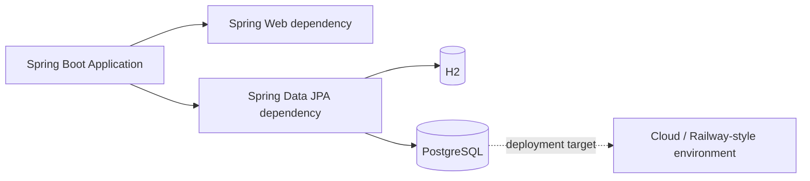

<div align="center">

# Spring Boot Cloud API Scaffold

A minimal Java/Spring Boot foundation prepared for REST development, relational persistence, and cloud deployment experiments.

`Java 17` · `Spring Boot 3.2.10` · `Spring Web` · `Spring Data JPA` · `H2` · `PostgreSQL` · `Maven`

</div>

## Overview

This repository is a **Spring Boot API scaffold**, not yet a complete REST service. The current codebase contains the application bootstrap class and project configuration, while the Maven model already includes the main dependencies needed for a conventional cloud-backed REST API.

The project is located under `APIRestCloudRailway/`.

## Current Architecture



## What Is Implemented

- Spring Boot 3.2.10 application bootstrap;
- Java 17 configuration;
- Maven Wrapper;
- Spring Web dependency;
- Spring Data JPA dependency;
- H2 runtime driver;
- PostgreSQL runtime driver;
- Spring Boot test dependency;
- application name configuration.

## What Is Not Implemented Yet

The repository currently does **not** contain domain entities, repositories, services, REST controllers, API endpoints or a versioned Railway deployment configuration. For that reason, it should be understood as the foundation for a cloud API rather than a finished API.

## Project Structure

```text
ApiRestCloudRailway/
├── README.md
├── .idea/                     # IDE metadata currently versioned
└── APIRestCloudRailway/
    ├── pom.xml
    ├── mvnw
    ├── mvnw.cmd
    └── src/
        ├── main/java/
        ├── main/resources/
        └── test/
```

## Build and Run

```bash
git clone https://github.com/Dyogo199/ApiRestCloudRailway.git
cd ApiRestCloudRailway/APIRestCloudRailway
./mvnw spring-boot:run
```

Windows:

```powershell
mvnw.cmd spring-boot:run
```

## Engineering Roadmap

1. define the first domain model;
2. implement JPA repositories and service layer;
3. expose versioned REST endpoints;
4. add request validation and exception handling;
5. configure PostgreSQL through environment variables;
6. add Flyway or Liquibase migrations;
7. add OpenAPI/Swagger documentation;
8. add unit and integration tests;
9. add CI with GitHub Actions;
10. document and validate the deployment workflow;
11. move the Maven project to the repository root;
12. remove IDE metadata from version control.

## Author

**Dyogo Mondego**  
Software Engineer · MSc Student in Computer Science @ IME-USP
